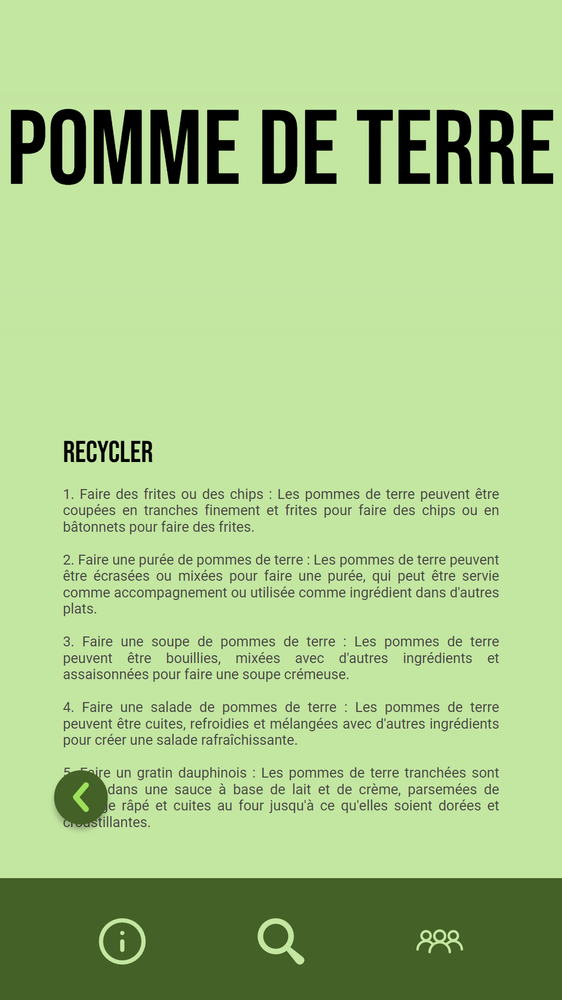
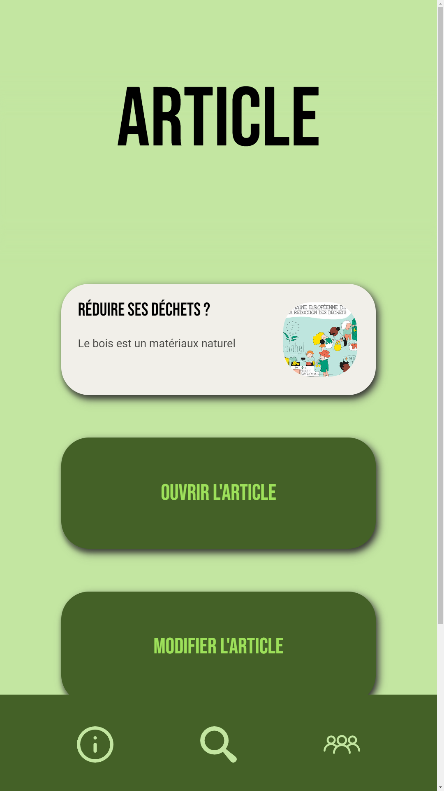

<p align="center">
  
</p>

# Ekoroji

Ekoroji est une application web qui permet de rechercher des informations sur les déchets et les articles. Elle utilise Flask et l'API OpenAI pour offrir des fonctionnalités de recherche et de gestion d'articles.

## Technologies utilisées

Ekoroji est construite en utilisant les technologies suivantes :

- Python 3.x
- Flask
- L'API OpenAI


## Configuration de la clé d'API OpenAI

Avant de pouvoir exécuter Ekoroji, vous devez configurer votre clé d'API OpenAI. Voici les étapes à suivre :

1. Créez un compte sur la plateforme RapidAPI.
2. Accédez à la page de l'API OpenAI sur RapidAPI.
3. Abonnez-vous à l'API pour obtenir votre clé d'API.
4. Ouvrez le fichier openai/keyencryption.py.
5. Utilisez le code ci-dessous pour configurer votre clé d'API (src/app/openai/key_to_encryption.py):
    ```python
    from keyencryption import KeyEncryption

    key_api = KeyEncryption()
    key_api.setKeyClean(input('key: '))
    print(key_api.getKeyEncrypted())
    ```
6. Copiez la clé d'API chiffrée retournée.
7. Ouvrez le fichier src/app/openai/key_api.txt.
8. Remplacez la valeur déjà présente par la clé d'API chiffrée que vous avez copiée.

Maintenant, vous êtes prêt à exécuter Ekoroji en utilisant votre clé d'API OpenAI configurée.

## Installation et exécution de l'application

1. Cloner le projet Ekoroji depuis GitHub en utilisant la commande suivante :
    ``` bash
    git clone https://github.com/Les-4-fantastiques/ekoroji.git
    ```
2. Naviguez vers le répertoire du projet avec la commande :
    ``` bash
    cd ekoroji
    ```
3. Installez les bibliothèques requises avec la commande suivante :
    ``` bash
    pip install -r requirements.txt
    ```
4. Vous pouvez maintenant exécuter l'application avec la commande suivante :
    ``` bash
    python run.py
    ```
5. Ouvrez votre navigateur et accédez à l'adresse http://localhost:5000 pour voir l'application Ekoroji en action.

Assurez-vous d'avoir Python 3.x installé sur votre système avant de commencer. Si ce n'est pas le cas, téléchargez-le depuis le site officiel de Python et installez-le.

## Fonctionnalités de l'application

L'application Ekoroji permet de :

- Recherche d'informations sur les déchets en utilisant l'API OpenAI.
- Ajout, modification et suppression d'articles.
- Affichage de la liste des articles.
- Recherche d'articles à l'aide d'un formulaire de recherche.

## Contributeurs

- [@untypequicode](https://github.com/untypequicode) : manager | développeur Python | développeur web
- [@ambre66160](https://github.com/ambre66160) : développeuse web
- [@benoiurlc](#) : responsable de base de données
- [@ghostizzoks](#) : développeur Python


## Galerie d'images
<center>
<h4>Les pages principales</h4>
<p float="left">
  
   
  
</p>
<h4>Les déchets</h4>
<p float="left">
  
   
  
  
</p>
<h4>Les articles</h4>
<p float="left">
  
   
  
</p>
</center>
