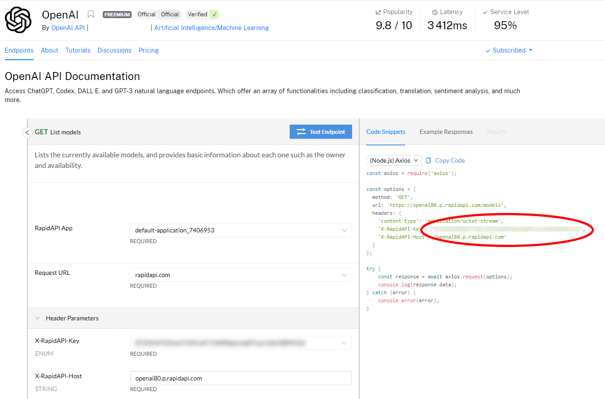
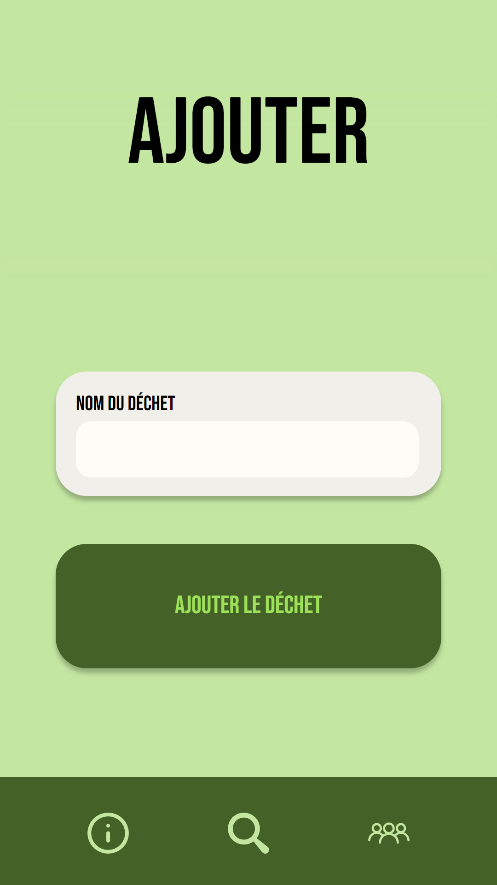
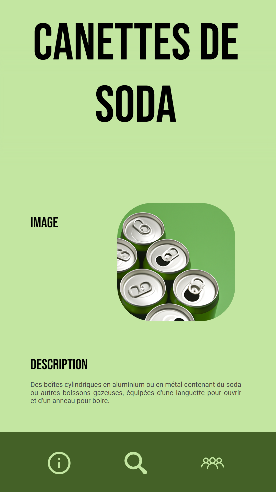
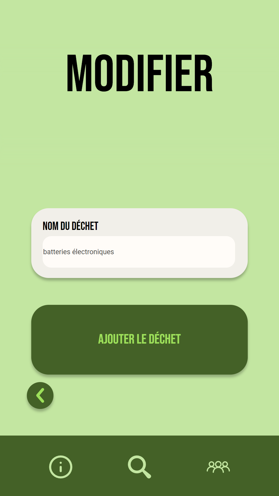
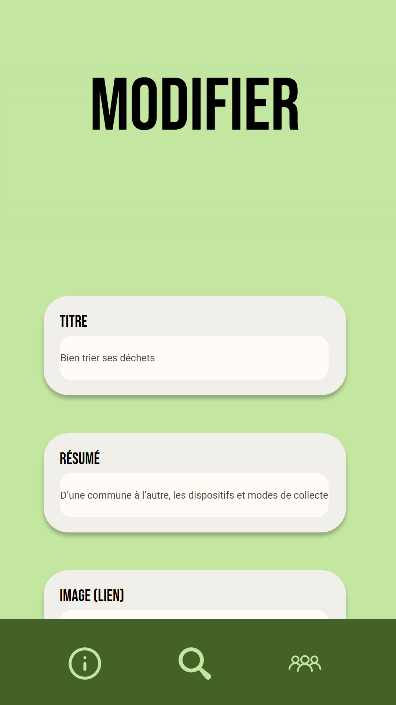

<div class="banner", align="center">
  
</div>

---

<div align="center">
  
  
  
</div>
<br>
<div align="center">
  
  
  
  
  
  
</div>

---

# Ekoroji

## Table des matières
- [Introduction](#introduction)
- [Installation](#installation)
  - [Prérequis](#prérequis)
  - [Configuration de la clé d'API OpenAI](#configuration-de-la-clé-dapi-openai)
  - [Exécution de l'application](#exécution-de-lapplication)
- [Fonctionnalités de l'application](#fonctionnalités-de-lapplication)
- [Contributeurs](#contributeurs)
- [Galerie](#galerie)

---

<a name="introduction"></a>
## Introduction

L'origine de ce projet découle du constat que de nombreuses personnes ne savent pas comment trier leurs déchets correctement, ce qui a un impact négatif sur l'environnement. Nous avons donc voulu créer une solution qui permettrait à chacun de devenir un écocitoyen responsable et de contribuer à la protection de notre planète.

Ekoroji est une application web conçue pour simplifier la recherche et la gestion des déchets. Elle est construite en utilisant le framework Flask et l'API OpenAI pour fournir des informations précises et fiables dans l'ensemble sur les différents types de déchets. Les utilisateurs peuvent rechercher des déchets spécifiques à l'aide d'un formulaire de recherche convivial et trouver des informations détaillées sur leur gestion, leur recyclage, leur réutilisation et leur élimination.

Ekoroji offre également aux utilisateurs la possibilité de contribuer à la base de données en ajoutant des informations sur les déchets. Ils peuvent ajouter, modifier ou supprimer les déchets existants pour maintenir la base de données à jour et pertinente.

En outre, Ekoroji propose des fonctionnalités de filtrage des résultats de recherche pour permettre aux utilisateurs de trouver des informations spécifiques en fonction du nom, de la description, etc. L'application fournit également des informations utiles sur les différentes options de gestion des déchets, telles que le tri et le recyclage.

En somme, Ekoroji est une application web pratique et complète pour la recherche et la gestion des déchets. Elle fournit des informations fiables et précises sur les différents types de déchets, tout en permettant aux utilisateurs de contribuer à la base de données et de trouver des informations spécifiques selon leurs besoins. Ekoroji encourage les utilisateurs à adopter une approche responsable dans la gestion de leurs déchets et à contribuer à la protection de l'environnement.

[La vidéo de présentation](https://peertube.lyceeconnecte.fr/w/tb2wkZo5HsmzzbVm4WcMRh)

---

<a name="installation"></a>
## Installation

<a name="prérequis"></a>
### Prérequis

> 🗒️ **:** Les instructions suivantes ont été testées sur un système d'exploitation Windows. Cependant elles devraient fonctionner sur n'importe quel système d'exploitation tel que Linux ou Mac OS.

1. Assurez-vous d'avoir Python 3.11 installé sur votre système avant de commencer. Si ce n'est pas le cas, téléchargez-le depuis le site officiel de [Python](https://www.python.org/downloads/) et installez-le.

2. Cloner le projet Ekoroji depuis GitHub en utilisant la commande suivante :
    ``` bash
    git clone https://github.com/Les-4-fantastiques/ekoroji.git
    ```
3. Naviguez vers le répertoire du projet avec la commande :
    ``` bash
    cd ekoroji
    ```
4. Installez les bibliothèques requises avec la commande suivante :
    ``` bash
    pip install -r requirements.txt
    ```


<a name="configuration"></a>
### Configuration de la clé d'API OpenAI

Avant de pouvoir exécuter Ekoroji, il est important de noter que nous utilisons l'API OpenAI. Pour cela vous devez configurer votre clé d'API OpenAI. Voici les étapes à suivre :

> ⚠️ **:** L'utilisation de l'API OpenAI n'est pas obligatoire pour ce projet, cependant elle est nécessaire pour utiliser les fonctionnalités de génération de texte et d'image. Si vous ne souhaitez pas utiliser l'API OpenAI, vous pouvez passer à l'étape [suivante](#exécution-de-l'application).

> 🗒️ **:** Si vous ne possédez pas de clé d'API OpenAI, vous pouvez en obtenir une gratuitement en suivant les instructions ci-dessous.

1. Créez un compte sur la plateforme [RapidAPI](https://rapidapi.com).

2. Accédez à la page de l'[API OpenAI](https://rapidapi.com/openai-api-openai-api-default/api/openai80) sur RapidAPI.

3. Abonnez-vous à l'API pour obtenir votre clé d'API.

<p align="center">
  
</p>

4. Ouvrez le fichier `sources/app/openai/key_to_encryption.py`.

5. Lancez le code, rentrez votre clé d'API quand il vous la demande.

6. Copiez la clé d'API chiffrée retournée.

7. Ouvrez le fichier `sources/app/openai/key_api.txt`.

8. Remplacez la valeur déjà présente par la clé d'API chiffrée que vous avez copiée.

Maintenant, vous êtes prêt à exécuter Ekoroji en utilisant votre clé d'API OpenAI configurée.

> 🗒️ **:** Pour accéder à votre quota de demande à l'API, nous vous redirigeons vers [cette page](https://rapidapi.com/developer/billing/subscriptions-and-usage).

<a name="exécution-de-l'application"></a>
### Exécution de l'application

1. Vous pouvez maintenant exécuter l'application avec la commande suivante :
    ``` bash
    python sources/run.py
    ```
    > 🗒️ **:** Assurez vous d'être dans le répertoire du projet avant d'exécuter cette commande.
2. Ouvrez votre navigateur et accédez à l'adresse http://localhost:5000 pour voir l'application Ekoroji en action.

3. Pour profiter de l'experience utilisateur sur notre site, vous devrez soit :
  - Utiliser un écran vertical pour bénéficier de la version portrait.
    > 🗒️ **:** Les fonctionnalités de l'application ne sont pas optimisées pour les écrans horizontaux.
  - Utiliser le mode développeur `F12` ou `inspecter` de votre navigateur en passant en mode téléphone pour bénéficier de la version portrait.
    > 🗒️ **:** Nous avons conçu le site avec un format 1080x2400 mais il est possible de l'utiliser sur d'autres formats tels que les formats de téléphone proposés par votre navigateur.
    

---

<a name="fonctionnalités"></a>
## Fonctionnalités de l'application

L'application Ekoroji permet de :

- Rechercher des informations sur les déchets en utilisant l'API OpenAI.
- Ajouter, modifier et supprimer des articles.
- Afficher la liste des articles.
- Rechercher les déchets à l'aide d'un formulaire de recherche.
> 🗒️ **:** Le site web n'a pas d'accès différent selon le rôle de l'utilisateur. Tous les utilisateurs peuvent ajouter, modifier et supprimer des articles.

---

<a name="contributeurs"></a>
## Contributeurs

- [@untypequicode](https://github.com/untypequicode) `Ethan FACCA` : manager | développeur Python | développeur web
- [@ambre66160](https://github.com/ambre66160) `Ambre FLORETTE` : développeuse web
- [@benoiurlc](#) `Benoît URLACHER` : responsable de base de données
- [@ghostizzoks](#) `KYLIAN ZHEN-CLAVERIE` : développeur Python
<p align="center">

</p>

---

<a name="galerie"></a>
## Galerie
<p align="center">
  
</p>
<h4>Les pages principales</h4>
<p align="center">
  
   
  
</p>
<h4>Les déchets</h4>
<p align="center">
  
   
  
  
  
</p>
<h4>Les articles</h4>
<p align="center">
  
   
  
  
</p>